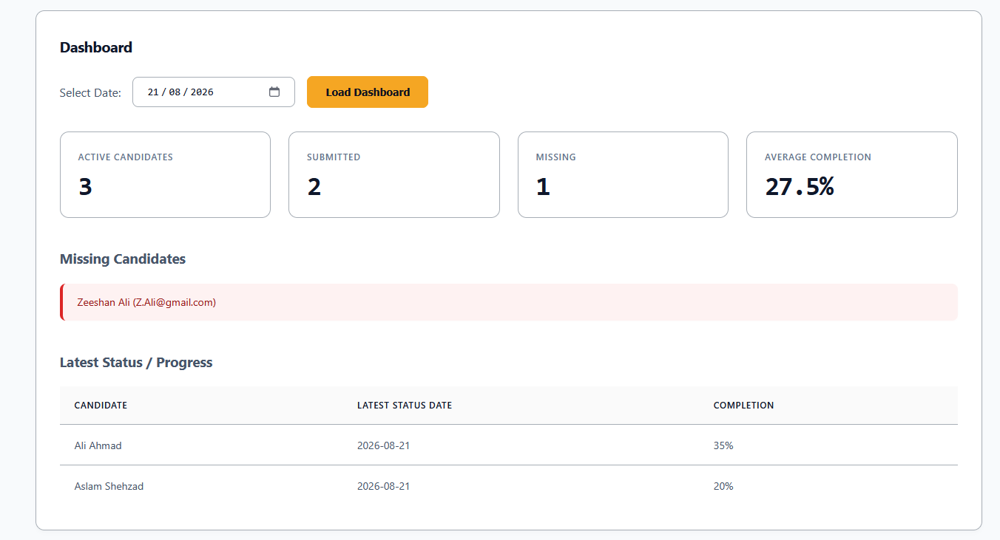
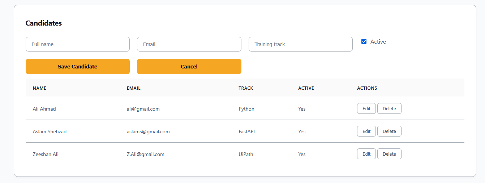
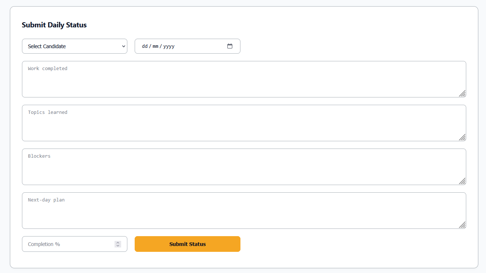
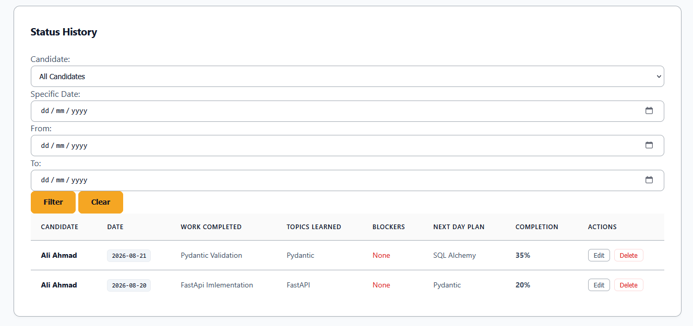

# Intern Status Tracker

A full-stack web application for tracking interns' daily work status, progress, blockers, and next-day plans. The application allows users to manage candidates, submit and manage daily status reports, and view a dashboard showing submitted and missing statuses.

---

## Project Overview

The Intern Status Tracker was developed as a full-stack application using FastAPI, PostgreSQL, SQLAlchemy, Pydantic, HTML, CSS, JavaScript, and Docker.

The system provides:

- Candidate management
- Daily status management
- Status history and filtering
- Dashboard with completion statistics
- Identification of candidates who missed their status
- Input validation and error handling
- PostgreSQL database storage
- Dockerized backend, frontend, and database
- Automated backend testing using pytest

---

## Technologies Used

### Backend

- Python
- FastAPI
- SQLAlchemy
- Pydantic
- PostgreSQL
- Uvicorn

### Frontend

- HTML
- CSS
- JavaScript
- Fetch API
- Nginx

### Testing

- pytest
- FastAPI TestClient

### DevOps

- Docker
- Docker Compose
- PostgreSQL Docker image
- Docker volumes
- Environment variables

---

## Project Structure
```text
intern-status-tracker/
│
├── backend/
│   ├── __init__.py
│   ├── candidates.py
│   ├── dashboard.py
│   ├── database.py
│   ├── Dockerfile
│   ├── main.py
│   ├── models.py
│   ├── requirements.txt
│   ├── schemas.py
│   └── statuses.py
│
├── frontend/
│   ├── .dockerignore
│   ├── app.js
│   ├── Dockerfile
│   ├── index.html
│   ├── nginx.conf
│   └── style.css
│
├── tests/
│   ├── conftest.py
│   ├── test_candidates.py
│   ├── test_statuses.py
│   └── test_dashboard.py
│
├── venv/
├── .env
├── .env.example
├── .gitignore
├── docker-compose.yml
└── README.md
```

---

# Architecture

The application follows a three-service architecture using Docker Compose.

                    ┌─────────────────┐
                    │    Frontend     │
                    │   HTML / CSS    │
                    │   JavaScript    │
                    │      Nginx      │
                    └────────┬────────┘
                             │
                           HTTP
                             │
                             ▼
                    ┌─────────────────┐
                    │     FastAPI     │
                    │     Backend     │
                    │                 │
                    │ CRUD Operations │
                    │ Dashboard       │
                    │ Validation      │
                    └────────┬────────┘
                             │
                         SQLAlchemy
                             │
                             ▼
                    ┌─────────────────┐
                    │   PostgreSQL    │
                    │    Database     │
                    └─────────────────┘


The frontend communicates with FastAPI using JavaScript's `fetch()` API.

FastAPI uses SQLAlchemy to communicate with PostgreSQL.

Docker Compose manages the backend, frontend, and database services.

---

# Database Design

The application contains two main tables:

* `candidates`
* `daily_statuses`

## Candidates Table

| Column         | Description            |
| -------------- | ---------------------- |
| id             | Primary key            |
| full_name      | Candidate's full name  |
| email          | Candidate email        |
| training_track | Training track         |
| is_active      | Active/inactive status |
| created_at     | Record creation time   |
| updated_at     | Last update time       |

## Daily Statuses Table

| Column                | Description                        |
| --------------------- | ---------------------------------- |
| id                    | Primary key                        |
| candidate_id          | Foreign key referencing candidates |
| status_date           | Date of the status                 |
| work_completed        | Work completed during the day      |
| topics_learned        | Topics learned                     |
| blockers              | Problems or blockers               |
| next_day_plan         | Planned work for the next day      |
| completion_percentage | Completion percentage from 0–100   |
| created_at            | Record creation time               |
| updated_at            | Last update time                   |

### Relationship

Each candidate can have multiple daily status records.

Candidate
    │
    └── 1 : Many ── DailyStatus

A foreign key connects:

daily_statuses.candidate_id
        ↓
candidates.id


A unique constraint is applied to:

candidate_id + status_date

This prevents a candidate from submitting more than one status for the same date.

---

# Features

## Candidate Management

Users can:

* Add a candidate
* View all candidates
* View an individual candidate
* Edit candidate information
* Delete a candidate
* Mark a candidate as active or inactive

Candidate information includes:

* Full name
* Email
* Training track
* Active/inactive status
* Created date

---

## Daily Status Management

Users can:

* Create a daily status
* View status history
* View an individual status
* Edit a status
* Delete a status
* Filter statuses by candidate
* Filter statuses by date
* Filter statuses by date range

Each daily status contains:

* Candidate
* Status date
* Work completed
* Topics learned
* Blockers
* Next-day plan
* Completion percentage

The application prevents:

* Future status dates
* Duplicate statuses for the same candidate and date
* Invalid completion percentages
* Invalid or missing required fields

---

# Dashboard

The dashboard provides an overview of intern progress for a selected date.

It displays:

* Total active candidates
* Number of submitted statuses
* Number of missing statuses
* Average completion percentage
* Submitted candidates
* Missing candidates
* Latest status from candidates
* Candidates sorted by completion percentage

Candidates who have not submitted a status for the selected date are clearly highlighted.

---

# API Endpoints

## Candidates

### Create Candidate

POST /api/candidates/

### Get All Candidates

GET /api/candidates/

### Get Candidate

GET /api/candidates/{id}

### Update Candidate

PUT /api/candidates/{id}


### Delete Candidate

DELETE /api/candidates/{id}


---

## Daily Statuses

### Create Status

POST /api/statuses/

### Get Statuses

GET /api/statuses/

Supported filters:

candidate_id
status_date
date_from
date_to


Example:

GET /api/statuses/?candidate_id=1


### Get Status

GET /api/statuses/{id}


### Update Status

PUT /api/statuses/{id}


### Delete Status

DELETE /api/statuses/{id}


---

## Dashboard

### Dashboard Summary

GET /api/dashboard/summary?date=YYYY-MM-DD


Example:


GET /api/dashboard/summary?date=2026-08-24


The response contains:

* Total active candidates
* Submitted count
* Missing count
* Average completion percentage
* Submitted candidates
* Missing candidates
* Latest statuses

---

# Validation and Error Handling

The backend uses Pydantic for request validation.

Validation includes:

* Required fields
* Maximum field lengths
* Valid email format
* Completion percentage between 0 and 100
* Non-empty required text fields
* Prevention of future status dates

The API also handles common errors.

| Situation              | HTTP Status |
| ---------------------- | ----------: |
| Successful request     |         200 |
| Successful creation    |         201 |
| Invalid input          |         422 |
| Invalid status date    |         400 |
| Record not found       |         404 |
| Duplicate daily status |         409 |

---

# Docker Configuration

The application uses Docker Compose to run three services:


backend
frontend
db


### Backend

The FastAPI backend is containerized using a Python Docker image and runs using Uvicorn.

### Frontend

The frontend is served using Nginx.

### Database

PostgreSQL 16 is used as the database.

A persistent Docker volume is used for PostgreSQL data so that database information remains available after containers are restarted.

The database credentials are provided using environment variables.

Passwords are not hardcoded in the application source code.

---

# Running the Application

## Requirements

Install:

* Docker Desktop
* Git

The complete application can be run using Docker Compose.

---

## Environment Configuration

Create a `.env` file based on `.env.example`.

Example:

```env
POSTGRES_DB=intern_tracker
POSTGRES_USER=postgres
POSTGRES_PASSWORD=your_password
DATABASE_URL=postgresql://postgres:your_password@db:5432/intern_tracker
```

Do not commit the actual `.env` file containing database credentials.

---

## Start the Application

From the project root, run:

```bash
docker compose up --build
```

After the containers start:

Frontend:


http://localhost


Backend:


http://localhost:8000


FastAPI Swagger documentation:


http://localhost:8000/docs


---

## Stop the Application

```bash
docker compose down
```

The PostgreSQL data remains stored in the Docker volume.

---

# Testing

Backend tests are written using pytest.

The test suite covers important application functionality, including:

1. Creating a candidate
2. Creating a daily status
3. Rejecting a duplicate daily status
4. Updating a status
5. Handling a missing record
6. Identifying candidates who missed a selected date

Tests are kept separate from the main application code in the root-level `tests` directory.

Run the tests using:

```bash
pytest
```

The tests should use a separate test database so that test data does not affect the main application database.

---

# Assumptions

* Only active candidates are included in dashboard calculations.
* A candidate can submit only one daily status per date.
* Status dates cannot be in the future.
* Completion percentage must be between 0 and 100.
* PostgreSQL is used as the application's database.
* SQLite is not used.
* Authentication is not required for the current implementation.
* The application is intended for internal use and does not currently include user accounts or authorization.

---

# Screenshots

## Dashboard



## Candidate Management



## Daily Status Management



## Status History



---

# Future Improvements

Possible future improvements include:

* Pagination
* CSV export
* Progress charts
* Authentication and authorization
* Alembic database migrations
* API documentation enhancements
* Automated CI/CD testing

---

# Assignment Requirements

The project was developed using the technologies specified in the assignment:

* Python
* FastAPI
* PostgreSQL
* Docker
* Docker Compose
* HTML
* CSS
* JavaScript
* SQLAlchemy
* Pydantic
* pytest

The application provides candidate management, daily status tracking, dashboard reporting, filtering, validation, error handling, Docker-based deployment, and automated backend testing.

---

# Author

Qamar Moeen
